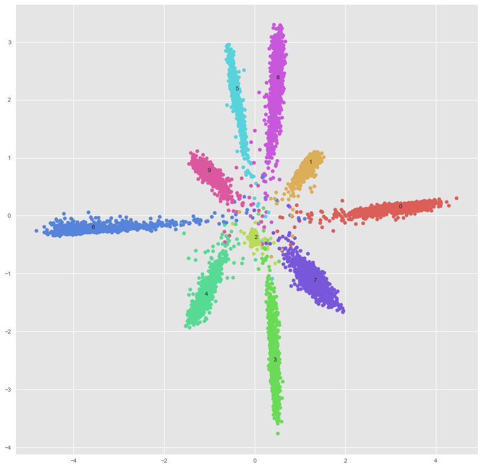
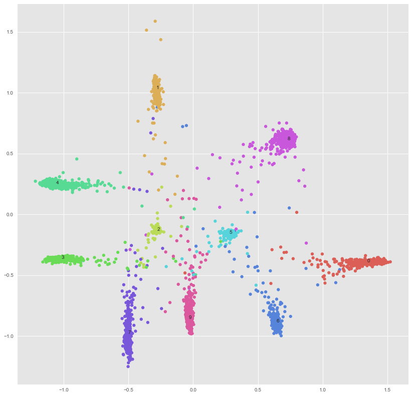
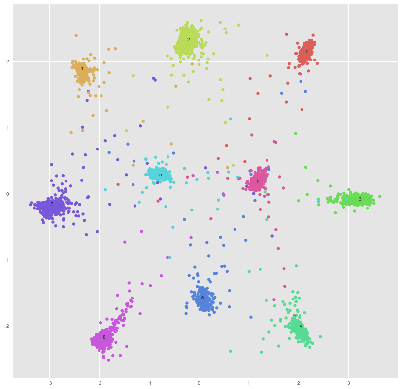

# L-GM-Loss For MXNet/Gluon

My implement of `Rethinking Feature Distribution for Loss Functions in Image Classification` using `MXNet/Gluon`

## Some Details

- In original paper, the L-GM-loss was formulated as $L_{GM} = L_{cls} + \lambda L_{lkd}$, where the regularization term $L_{lkd} = d_{z_{i}} + \frac{1}{2}log|\Lambda_{z_{i}}|$. But when i implement it i find that it's pretty hard to optimize this term beacuse the loss also lead to a small variance(much smaller than a identity matrix), so $\frac{1}{2}log|\Lambda_{z_{i}}|$ will decrease to **-inf** after several iterations and also make the loss **Nan**. I tried 2 ways to cover this problem 

  > 1. Remove the regularization term and only optimize the classification loss
  > 2. Remove the $\frac{1}{2}log|\Lambda_{z_{i}}|$ and keep the regularization term

  this 2 solutions seem to fix the problem but since the regularization term is inferred from it's likelihood, simply removed is not a good way

- The L-GM-Loss layer has two paramters:`mean`,`var`. You can't use traditional init way like `Xavier` etc. to initialize the `var` because the variance of a distribution is non-negative, the negative variance will also lead to the **Nan** loss. In my implement, i use a constant value 1 to initialize the `var`

## Images

I plot the features distribution in my experiment, but as you can see below, there are quit different from the original paper, i will talk about the difference latter.

### Removing the regularization term

</img>

i set the $\alpha$ to 0.1, you can see the clear margin between classes, but some classes' distribution are extremely flat which means the variance of those distribution varies a lot in different dimemsions. I guess it's pretty tricky to optimize the variance, yet i dont have a good idea to fix this maybe i should reimplement it using `customop` that requires to implement the backward by myself, if you have any idea about that please tell me :)

### Removing the $\frac{1}{2}log|\Lambda_{z_{i}}|$

</img>

still suffering from the variance problem :cry: 

the author released code is written in `caffe` and `cuda`, you can find it in [here](https://github.com/WeitaoVan/L-GM-loss)
## Update
By adding a lr_mult term to the variance(set a low learning rate) i fixed the problem, here is the result.
</img>

